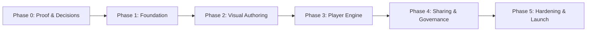

# WebJourney — Project Tasklist & Milestones

> **Product**: WebJourney Chrome Extension
> **Repository Model**: Monorepo (`apps/*`, `packages/*`)
> **Commit Policy**: Author: `Ahmed Zobayer <zobayer.me@gmail.com>`, strictly no co-author tags.

---

## 🎯 Development Roadmap

---

## Phase 0 — Technical Feasibility & Architecture Decisions
*Goal: Prove permissions, isolated DOM injection, target selection and SPA lifecycle on a controlled demo app.*

- [x] **WJ-001**: Document supported Chrome versions, permissions UX, iframe/shadow-DOM boundaries and non-goals.
- [x] **WJ-002**: Prototype origin-scoped content-script injection, isolated highlight overlay (Shadow DOM) and safe teardown.
- [x] **WJ-003**: Record ADRs for frontend stack (React + Vite + TypeScript), state model and backend strategy.
- [x] **WJ-004**: Build controlled multi-page demo application (`apps/demo-site`) covering clicks, inputs, dynamic re-rendering, and SPA routes.

---

## Phase 1 — Foundation & Core Infrastructure
*Goal: Set up MV3 extension shell, typed messaging bus, and shared schema contracts.*

- [x] **WJ-101**: Setup MV3 extension structure (`apps/extension`): manifest v3, popup, side panel, background service worker, and content-script lifecycle.
- [x] **WJ-102**: Build typed, validated extension message bus (`content <-> background <-> sidepanel/popup`) resilient to service worker suspension.
- [x] **WJ-103**: Implement and validate Journey Schema (`packages/journey-schema`) using TypeScript + Zod (definitions, actions, target fingerprints, validation).
- [x] **WJ-104**: Setup unified build, linting (ESLint), formatting (Prettier), and testing (Vitest).
- [x] **WJ-105**: Draft initial backend schema & API boundary contracts for later persistence.

---

## Phase 2 — Visual Authoring Experience
*Goal: Enable non-technical authors to visually select targets and create 5-step journeys.*

- [ ] **WJ-201**: Implement interactive element picker with hovering inspector and scroll/resize handling.
- [ ] **WJ-202**: Implement multi-heuristic target fingerprinting (IDs, stable data attributes, accessible roles/labels, selector fallback hierarchy).
- [ ] **WJ-203**: Build Side Panel Step Editor: instruction copy, action type (click, type-completed, navigation, manual continue), timeouts, reordering.
- [ ] **WJ-204**: Step preview & live test mode in the active tab with error diagnostic badges.
- [ ] **WJ-205**: Local draft persistence (`chrome.storage.local`) with export/import capabilities.

---

## Phase 3 — Player Engine & Overlay
*Goal: Provide a rock-solid, accessible on-page guided experience that observes completion without interfering with the host page.*

- [ ] **WJ-301**: Implement finite-state player engine (`packages/step-engine`): `idle -> resolving -> active -> verifying -> advance/retry/blocked -> finished`.
- [ ] **WJ-302**: Implement completion observers:
  - Click observer (trusted event on target)
  - Field-complete observer (presence/focus/non-empty without capturing input values)
  - Navigation observer (URL matcher / path transition)
  - Manual continue observer
- [ ] **WJ-303**: Handle SPA route changes, dynamic DOM mutations, and viewports with throttling & clean listener teardown.
- [ ] **WJ-304**: Build Shadow-DOM player overlay: spotlight highlight, floating adaptive tooltip, back/pause/resume/exit controls.
- [ ] **WJ-305**: Resumable run state in `chrome.storage.local` with session recovery on page reload.
- [ ] **WJ-306**: Broken target recovery flow (missing target detection, retry prompt, skip policy, issue logger).

---

## Phase 4 — Publishing, Sharing & Governance
*Goal: Allow authors to publish immutable versions and share secure invitation links with learners.*

- [ ] **WJ-401**: Publish immutable journey versions (frozen snapshot separated from draft).
- [ ] **WJ-402**: Create invitation token generator (hashed tokens, expiry, revocation).
- [ ] **WJ-403**: Learner invitation flow: preview summary, origin permission grant, and playback initiation.
- [ ] **WJ-404**: Minimal completion events & sanitized diagnostic issue reporting.

---

## Phase 5 — Hardening, Privacy & Launch Readiness
*Goal: Security audits, accessibility compliance, packaging, and Chrome Web Store submission.*

- [ ] **WJ-501**: Security review: sanitization against XSS in instruction text, host permission scoping, origin boundaries.
- [ ] **WJ-502**: Cross-site browser QA matrix, keyboard navigation (`Tab`, `Escape`, `Enter`), and screen-reader accessibility.
- [ ] **WJ-503**: Privacy policy, data safety disclosures, and permission justifications for Web Store.
- [ ] **WJ-504**: Production packaging scripts and distribution builds.
- [ ] **WJ-505**: Pilot testing and final user feedback resolution.
